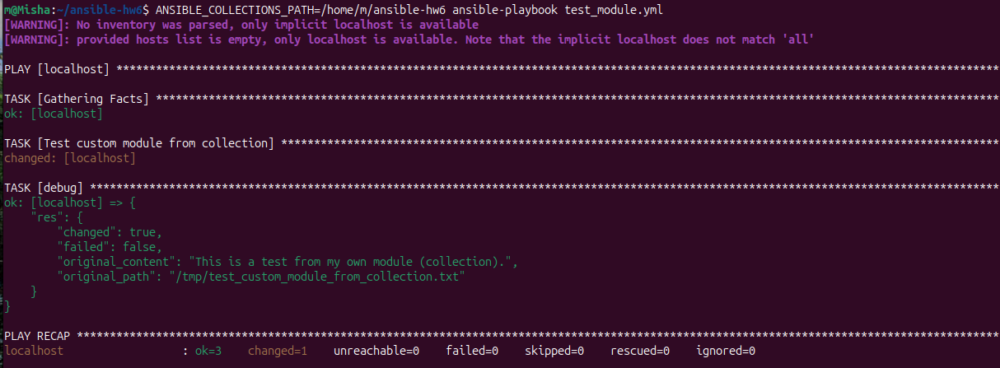
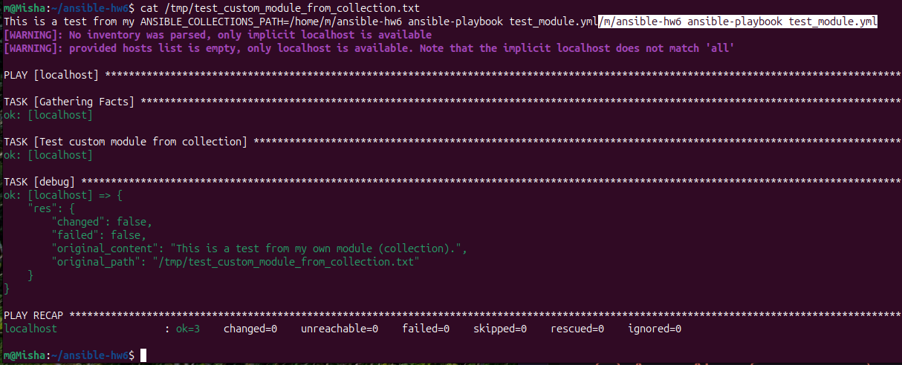
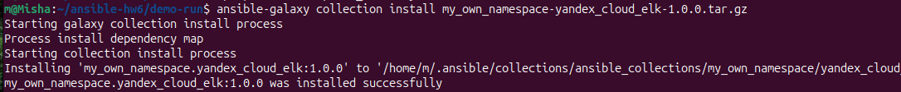
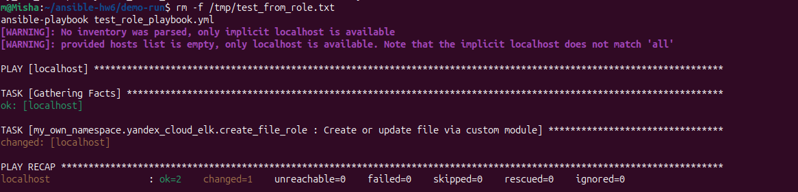
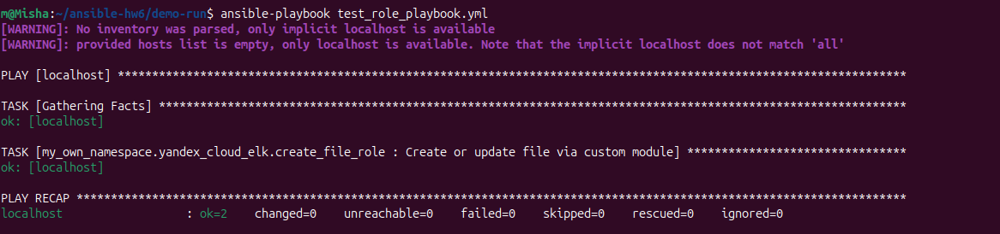

# my_own_namespace.yandex_cloud_elk

**Коллекция Ansible с кастомным модулем и ролью для создания/обновления текстовых файлов.**  
Выполнено в рамках домашнего задания к занятию 6 «Создание собственных модулей».

## Цель работы

Разработать собственный Ansible‑модуль, упаковать его в коллекцию, обернуть в роль с дефолтными параметрами, протестировать идемпотентность и оформить всё для сдачи (включая сборку `.tar.gz` и публикацию в GitHub).

---

## Что внутри

- `plugins/modules/file_creator.py` — кастомный модуль: создаёт/обновляет файл по параметрам `path` и `content`, возвращает `changed` при изменении.
- `roles/create_file_role` — роль, использующая модуль.
  - `tasks/main.yml` — вызов модуля.
  - `defaults/main.yml` — значения по умолчанию для параметров модуля.
- `galaxy.yml` — метаданные коллекции.
- `README.md` — эта документация.
- Примеры плейбуков и скрипты проверки.

---

## Как использовать

### Установка коллекции из архива

Если у вас есть `.tar.gz`-архив коллекции:

```bash
ansible-galaxy collection install my_own_namespace-yandex_cloud_elk-1.0.0.tar.gz --force
```
# Подтверждение выполнения пунктов задания

Ниже представлены визуальные доказательства выполнения ключевых пунктов домашнего задания.

## Пункт 4. Проверка модуля на исполняемость локально
**Что проверяли:** Запуск плейбука с кастомным модулем. Ожидаемый результат: `changed=1` (файл создан).
**Результат:** Модуль успешно отработал, файл создан, флаг `changed` установлен в `true`.



> *На скриншоте видно: строка `changed: [localhost]` и в PLAY RECAP значение `changed=1`.*

---

## Пункт 6. Проверка идемпотентности
**Что проверяли:** Повторный запуск того же плейбука без удаления целевого файла. Ожидаемый результат: `changed=0`.
**Результат:** Модуль определил, что файл уже существует и контент совпадает, изменений не внесено.



> *На скриншоте видно: строка `ok: [localhost]` и в PLAY RECAP значение `changed=0`. Это подтверждает идемпотентность.*

---

## Пункт 15. Установка коллекции из локального архива
**Что проверяли:** Установку собранной коллекции через `ansible-galaxy collection install`.
**Результат:** Коллекция успешно распакована в директорию коллекций Ansible.



> *На скриншоте виден вывод команды: `... was installed successfully` и путь установки.*

---

## Пункт 16. Запуск плейбука с ролью
**Что проверяли:** Работу роли, которая использует кастомный модуль.
**Результат:** Роль корректно применилась, файл создан/обновлен.





> *На скриншоте виден запуск плейбука `test_role_playbook.yml` и успешный результат (`ok=2, changed=1`).*

---

## Ссылки на артефакты

| Артефакт | Ссылка |
| :--- | :--- |
| **Репозиторий коллекции** | [Chehlov1M/my_own_collection](https://github.com/Chehlov1M/my_own_collection) |
| **Архив коллекции (.tar.gz)** | https://github.com/Chehlov1M/my_own_collection/blob/main/my_own_namespace-yandex_cloud_elk-1.0.0.tar.gz
